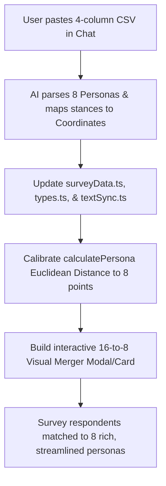

# Persona CSV Ingestion & 16-to-8 Visual Merger Implementation Plan

Ingest and streamline the Curbside Compass policy personas from 16 down to 8 distinct archetypes using a 4-column CSV format pasted directly in chat (`Persona`, `Stance on Regulations`, `Stance on Funding`, `Description`). The system will calibrate descriptive stance phrases into the 2-axis Policy Compass (2 per quadrant: Moderate vs Strong), update the survey scoring engine, and provide a visual side-by-side merger view connecting legacy profiles to their 8 successors.

---

## User Review Required

> [!IMPORTANT]
> **Key Decisions & Workflow Alignment**
> 1. **CSV Ingestion via Chat**: You will paste the CSV directly into our chat with the headers:
>    ```csv
>    Persona, Stance on Regulations, Stance on Funding, Description
>    ```
> 2. **Descriptive Stance to Coordinate Mapping**:
>    - **Regulations Axis ($X$)**: Ranging from deregulated / flexible (negative $X$) to structured / high regulation (positive $X$).
>    - **Funding Axis ($Y$)**: Ranging from private / market / low city subsidy (negative $Y$) to public investment / high civic funding (positive $Y$).
>    - We will map your descriptive phrases into the 8 quadrant target nodes: 4 moderate points at $(±0.45, ±0.45)$ and 4 strong points at $(±0.85, ±0.85)$.
> 3. **Visual 16-to-8 Merger View**: A dedicated interactive component in the app visually illustrating how the legacy 16 profiles map into the 8 new personas, preserving historical lineage and context.

---

## User Experience & Technical Architecture

### User Journey Flow



1. **Step 1: Paste CSV in Chat**: User pastes the 8 rows under `Persona, Stance on Regulations, Stance on Funding, Description`.
2. **Step 2: Automated Parsing & Coordinate Assignment**: The 8 personas are categorized into the 4 compass quadrants (2 per quadrant: one moderate, one strong) based on their descriptive stances.
3. **Step 3: Codebase Migration**: `surveyData.ts`, `types.ts`, and `textSync.ts` are updated to replace the 16 active personas with the 8 new ones. The 16 legacy profiles are preserved in a reference file (`legacyPersonas.ts`) for the visual merger.
4. **Step 4: Interactive Visual Merger**: Users and city staff can open a side-by-side viewer comparing the legacy 16 profiles with the 8 successor personas.
5. **Step 5: Live Compass Integration**: The `PolicyCompassGraph` renders the 8 clean nodes, showing each persona's name, stance highlights, and quadrant badge.

### Visual Identity & Design System

- **Color Palette (City of Edmonton Municipal & Curbside Palette)**:
  - Quadrant 1 (Preserve & Regulate): City Navy (`#004B87` / `text-edmonton-navy`)
  - Quadrant 2 (Flexible & Grassroots): Warm Amber (`#D97706` / `text-amber-600`)
  - Quadrant 3 (Market & Private Initiative): Emerald Green (`#059669` / `text-emerald-600`)
  - Quadrant 4 (Civic Investment & Mobility): Royal Indigo (`#4F46E5` / `text-indigo-600`)
- **Card Hierarchy**:
  - Persona Badges display: Name, Quadrant indicator, Stance tags (Regulation & Funding pills), and full civic Description.
- **Visual Merger View**:
  - Two-pane layout with fluid hover links connecting the 16 legacy items to the 8 unified archetypes.

### Technical Architecture & Component Hierarchy

```
App.tsx
├── Header & Navigation
├── PolicyCompassSection
│   ├── PolicyCompassGraph (8 coordinate nodes with Moderate/Strong radius rings)
│   ├── PersonaDetailCard (Displays active persona with Stance pills & Description)
│   └── PersonaMergerViewerModal (Side-by-side 16 -> 8 transition explorer)
│       ├── LegacyColumn (16 compact cards grouped by quadrant)
│       ├── ConnectionIndicators (Visual migration arrows/badges)
│       └── ActiveColumn (8 robust cards: 2 per quadrant)
└── SurveySection / ResultsSection
```

### Data Flow & State Management

```
Pasted CSV Text
       │
       ▼
src/data/surveyData.ts (PERSONA_PROFILES: 8 archetypes)
       │
       ├──► src/types.ts (Updated PersonaId union type)
       ├──► src/data/legacyPersonas.ts (16 legacy profiles archived with mapping keys)
       ├──► src/components/PolicyCompassGraph.tsx (Renders 8 coordinate nodes)
       └──► src/components/PersonaMergerViewer.tsx (Renders interactive 16-to-8 mapping)
```

---

## Phase-by-Phase Implementation Plan

### Phase 1: Ingestion & Parsing of Chat CSV
- Receive the pasted CSV text from chat.
- Parse the rows: `Persona`, `Stance on Regulations`, `Stance on Funding`, `Description`.
- Assign each to its corresponding quadrant and intensity ($±0.45$ for moderate, $±0.85$ for strong).

### Phase 2: Engine & Compass Recalibration
- Update `PERSONA_PROFILES` in `src/data/surveyData.ts` to exactly 8 profiles.
- Retain the legacy 16 profiles in `src/data/legacyPersonas.ts` alongside their explicit mappings to the 8 new IDs.
- Update `calculatePersona()` to compute nearest Euclidean neighbor across the 8 profiles.
- Update `types.ts` and `textSync.ts` to ensure full type-safety and text inventory alignment.

### Phase 3: Visual Side-by-Side Merger Component
- Build `PersonaMergerViewer.tsx` presenting:
  - 16 Legacy Personas on the left (compact summary, legacy badge).
  - 8 Active Personas on the right (rich description, stance badges, coordinates).
  - Visual lines/badges indicating which 2 legacy personas consolidated into each new persona.
  - Toggle or launch button directly from the Policy Compass / Results section.

### Phase 4: Verification & Polish
- Ensure all survey calculations, persona badges, result summaries, and export tools function smoothly without missing ID errors.
- Run `compile_applet` and `lint_applet` to confirm a clean build.

---

## Confidence Score & Risk Analysis

- **Confidence Score**: 98% (Clear, structured approach directly matching the user's workflow).
- **Potential Risks & Mitigations**:
  - *Risk*: Legacy survey sessions referencing old persona IDs.
    *Mitigation*: Provide an automatic fallback mapper so any stored survey response with an old persona ID seamlessly displays its corresponding successor persona.

---

## Verification Plan

### Automated Verification
- Run `compile_applet` to ensure full TypeScript compilation with zero type errors.
- Run `lint_applet` to verify no lint or formatting regressions.

### Manual Verification
1. Verify the 8 personas render correctly with their stance tags and full descriptions in the Policy Compass.
2. Confirm the 2-axis graph shows 8 distinct points (2 per quadrant).
3. Test the survey scoring to ensure respondents match smoothly to the new personas.
4. Open the 16-to-8 visual merger interface to inspect the migration mapping.
